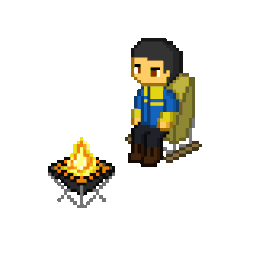

  
  
  <h1 style="font-weight: bold; margin-bottom: 0;">Hi, I'm Alejandro Romero 👨🏽‍💻</h1>
  
<code>Backend Developer</code> &nbsp;&middot;&nbsp; <code>Córdoba, Argentina</code>

  
  
Bridging the gap between complex business requirements and scalable, robust software architecture.

---

### Core Engineering Principles

* 📑 **Functional Analysis** — `Requirements Gathering` `Functional Specs` `Backlog Management`
* 🛠️ **Backend Architecture** — `Scalable Systems` `RESTful APIs` `Relational Databases`
* 🧪 **Software Quality** — `Clean Code` `SOLID Principles` `Integration Testing`

---

### 🚀 Tech Stack & Tools

| Category | Technologies & Tools |
| :--- | :--- |
| **Backend & Core** |     |
| **Databases & Infra** |    |
| **Agile & Quality** |     |
| **Frontend** |    |

---

### 🤝 Let's Connect

  
  &nbsp;&nbsp;
  

